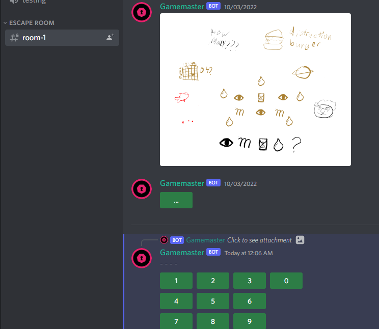

# Discord Escape Room

This project is a discord bot meant to emulate "escape room" puzzles using discord's ui toolkit.

## Examples

## Setup
Ensure you have created a mongoDB Atlas cluster with an API key, as well as a discord bot user.
Run `setup.py` and provide your api token and your bot user token. After this, install the dependencies in a virtual environment, then run `src/escaperoom/main.py`.

## Building an escape room server
The key component to begin creating an escape room setup is the slash command `/initialize`. To begin, run this in the server you want to start an escape room. (Admin permissions are required.)

This should create a new category called `ESCAPE ROOM`, with 1 channel named `room-1`.
To create new channels, use `/newroom`. Each room will also have an associated role.

Puzzles are the main structural component of your escape room. You can create a new puzzle using `/newpuzzle`, which requires a puzzle type and an answer. The puzzle type must match classnames from `puzzles.py` and each puzzle type has their own formatting for answers: see `puzzles.py` for more details. `/newpuzzle` returns the puzzle ID upon successful completion, which will be necessary later.

All puzzles are ephemeral components that are user-visible only and triggered on interaction. To make puzzles actually accessible, you will need to create triggers, using `newtrigger`. Triggers are permanent, publicly visible buttons that trigger a certain puzzle. Specify the puzzle by passing the puzzle ID to `/newtrigger`.

To allow users to progress through the rooms, use `/addrole`, passing in a puzzle ID and a room role. This will cause the completion of the specified puzzle to "reward" the user with a room role, allowing them to access another channel. The bot also comes with a "victory role" that can be assigned to completionists. A potential use for this would be to create a discussion channel only available to escape room completionists.

## Contributing
All puzzle types are located in `puzzles.py`. If you are interested in creating a new interactable puzzle/component, make sure that it extends `Puzzle` and is placed in that file. `Puzzle`, the superclass of all puzzle types, is located in `helpers.py`, along with the function that sends puzzles to an interaction.

All room setup related code is placed in `setup.py`. `main.py` is the main script.
